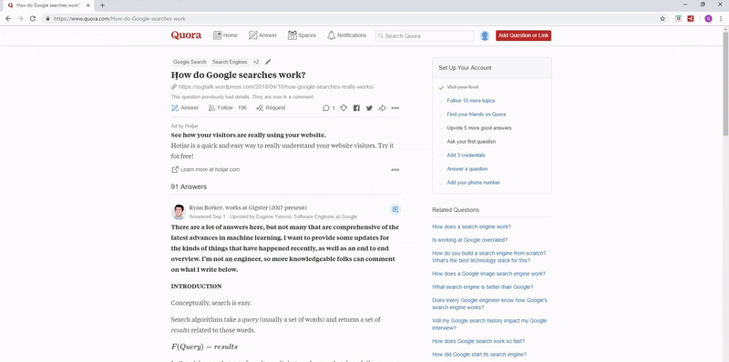

# Quora Explorer

**Quora Explorer** is a browser extension available for [Chrome](https://chrome.google.com/webstore/detail/efdnamipmhpnngkdhhobdpmkdmiloone) and [Firefox](https://addons.mozilla.org/en-US/firefox/addon/quora-explorer/) that displays a popover whenever a link to a related question is hovered.  The popover indicates the number of answers to the question as well as the answer that (likely) has the highest upvote count.  I built this extension because I often see interesting looking question titles in the "Related Questions" section on a Quora question page, but many of these questions have only a few low-quality answers and aren't worth looking at.  The extension remedies this by providing insight into the quality of the question's answers before I navigate to its page.  The extension's home page is: [https://www.quoraexplorer.com](https://www.quoraexplorer.com)

---

[__Client (Web Extension)__](#client-web-extension) 

[__Backend__](#backend)

[__Deployment__](#deployment)

---

## Client (Web Extension)
The web extension consists of a content script injected onto pages matching the pattern `"*://*.quora.com/*"`.  It's built with vanilla Javascript and CSS.  Using a framework like React probably would have made development feel much easier, but it's a relatively simple extension, so I decided to keep it lightweight and get a little refresher on how it feels to work with vanilla JS.

`client/explorer.js` is the content script that represents the entry point to the frontend application.  When a Quora question page loads, it parses through all of the related questions listed in the right sidebar, collecting them in a list of `client/models/RelatedQuestion.js` objects.  This list is passed to a new `PopoverManager` instance.  It adds a listener for `mouseenter` events on each related question link.  When a link is hovered, the script tells `popoverManager` to open a popover for the given question.  The script is also responsible for determining when it is time for the popover to be closed, which it does by tracking mouse position while the popover is open.

`PopoverManager` maintains all the data Quora Explorer knows about each related question.  As questions are hovered, data is collected and stored in its `relatedQuestions` instance variable.  Since only one popover will be open at a time, it also maintains the index of the question with the currently open popover.  The manager works closely with `PopoverBuilder` (an interface that directly manipulates the DOM to build/mutate popovers) to manage the state of popovers on the page.  When `PopoverManager.openPopover(questionId)` is called, it instantiates a new `PopoverBuilder`, passing to its constructor a reference to the `<li>` element of the selected question.  When a popover builder is created, it injects empty/default popover markup onto the DOM.  

The method then uses the builder's `setTitle()` and `setViewButtonUrl()` to initialize the popover with some basic data.  If the `RelatedQuestion` object corresponding to this question already knows its answer count and top rated answer, it passes this data to the builder and is done.  More likely, though, it will be its first time displaying a popover for this question, so the data will need to be fetched.  __Answer count__ is resolved by `QuestionScraper`, which uses the Fetch API to grab the markup for the related question and parse out its answer count.  This is pretty inexpensive from a runtime perspective.  __Top rated answer score__, in contrast, is much more difficult to retrieve.  Quora has an infinite scroll model -- it shows a subset of a question's answers, and requires scroll-down to reveal more.  This requires some server side work, which is explained in the [backend section](#backend).  Once the answer count data is retrieved, it is stored in the corresponding object in the `relatedQuestions` list and the popover's loading bar animation is triggered if the popover is still open.  When the top rated answer comes in (typically a few seconds after the answer count arrives) it updates the data in the model and fades out the loading bar.

It's no fun to add elements to the DOM without the help of a front-end framework.  DOM addition is done by either making a ton of calls to DOM APIs like `document.createElement()` and `element.setAttribute()` or writing up long HTML strings.  Neither is optimal.  I ended up making a `popover.html` file that isn't actually used at all in the extension, but is a good place to develop the markup that will be used, and get some help from IntelliJ's recognition of the `.html` extension.  I made an `HTMLFactory.js` class with a few methods that return HTML strings copied from `popover.html`.  In `PopoverBuilder.js`, I use `DOMParser`'s `parseFromString()` method to convert these HTML snippets into an actual DOM element tree, and use methods like `appendChild()`, `removeChild()`, and `insertBefore()` to manipulate the DOM as "cleanly" as possible.

Although I'm not using npm, webpack, or CSS preprocessing, there is still a simple __build process__ I need to make the extension production-ready.  I didn't realize the need for this until I tested the extension in Chrome (I originally developed it exclusively in Firefox).  Chrome handles references to image assets differently, so I need slightly different CSS to render the popover's background image correctly in each respective browser.  For this reason, I have two separate manifest files for each browser.  I wrote a build script in Python to handle this issue for me: `client/build.py`.  The script creates exploded and zipped directories for each browser in `client/builds`, resolving the correct manifest and CSS files, as well as removing some extraneous files that are used in development but aren't necessary for production.  To run this script, I `cd` into `/client` and run the command `python build.py`.

## Backend
Upon first look at this extension, you probably wouldn't see any need for server-side code.  Unfortunately, scraping a Quora question page with a simple `XMLHttpRequest` will only yield the first three answers.  This is because Quora employs "infinite scrolling" so that it only needs to load a handful of questions at a time.  As the user scrolls down towards the bottom of the page, it triggers requests to fetch more questions.  In order to simulate this repeated scrolling, I realized I need to use the [__Selenium__](https://www.seleniumhq.org/) browser testing framework.  To let the Selenium know when I need it and what page to look at, I exposed a REST endpoint the extension could send requests to using the [__Spring Boot__](https://spring.io/projects/spring-boot) Java web framework.  I don't dive deep into scraping in this readme, but it's worth noting I used [__JSoup__](https://jsoup.org/) to parse Quora page HTML.

#### Scraping/scroll strategy with Selenium
Exposing a REST endpoint with Spring Boot is trivial, so I'd instead like to walk through my process of devising an effective scroll strategy using Selenium.  

When the client sends a GET request to the `/api/top-rated-answer` endpoint with a single query parameter, `q`, representing the question id of a Quora question (the question id for the question located at `https://www.quora.com/What-is-data-science` is `What-is-data-science`), the `ExploreController.getTopRatedAnswer()` method is called.  Within the method, `AnswerExtractor.getAnswers()` is used to get a list of all the answers present on the question page in the form of `Answer` objects.  The answer extractor launches a Chrome browser that is programatically controlled by __Selenium WebDriver__.  The web driver, among other things, can execute Javascript on the page as well as get the page's rendered HTML at any time, which makes it perfect as a tool for discovering all answers to a question.

This task of discovering answers is complicated by the fact that answers are only rendered when the user operating the browser __scrolls down__.  This action can be performed in one line of Javascript: `window.scrollTo(0, document.body.scrollHeight)`.  This must be done at _strategic times_, because a executing this operation when the browser is already scrolled to the bottom will do nothing, rendering __0 additional answers__.  It follows that the program must _wait_ until more answers have been rendered between scroll-downs.  My original strategy was to wait an arbitrary amount of time between scrolls, say, 1.5 seconds.  Unfortunately, this was far from optimal, because some answer loads would take 2.5 seconds, while others would be completed in less than a second.  To get a better picture of what this looks like, here's an example of Selenium "reading Quora":

Notice how the browser, controlled by Selenium, waits for the page to load, then enters a loop of scrolling to the bottom, waits for more answers to load (I think it's set to wait around 1.75 seconds in this example), and scrolling down again.  While it does this, it's incrementally collecting HTML markup of more and more answers to the question.

__Trading correctness for time__: Quora loads, on average, 10-15 answers at a time.  If I'm waiting almost 2 seconds for each question batch, it'll take the good part of a minute for it to read through all the answers to find the highest rated one.  Nobody wants to wait for that.  I hypothesized that the top rated answer would typically appear near the top, so there would be no need to spend the excessive amount of time scrolling through _all_ of the questions.  I put this to the test by letting my answer collection algorithm run through 40 questions, which on average had 207 answers.  I found that the __average index of a top rated answer was 28__.  I also discovered that __for 70% of questions, the top answer was one of the first 36__.  I've been able to cut the time substantially by stopping the search after I've discovered 36 answers, because the top rated one is probably in there.  This was a worthwhile trade-off to make (correctness for time), because it's impractical to wait 20+ seconds for the top rated metric to be computed.

The arbitrary pause strategy is not what I ultimately ended up going with, though.  It's impractical because to be 100% successful, I'd have to wait the __worst case__ period of time for any given answer load, which would probably be greater than 2 seconds.  I'm really just waiting for the answers to load.  However, there's no event I can subscribe to for when this happens.  An alternative to a publish-subscribe model is _repetitive polling_.  

The algorithm that's currently implemented uses a loop that runs without any pausing, constantly checking the page's current scroll height and comparing it to the most recently recorded previous scroll height.  If the scroll height hasn't changed after 1.75 seconds (still kinda using an arbitrary time 😔), then we conclude there aren't any more questions to be loaded and stop scrolling.  When the scroll height does change, reset the previous scroll timestamp and scroll down to the bottom again.  When observing this technique, it's clear that Selenium is operating much quicker, as it is very clearly reacting to new loading events.  Unfortunately, the retrieval time for any given request to the `/top-rated-answer` endpoint is far from instant -- much of the time is spent during the initial page load, and DOM painting/parsing takes a while in general.  This new algorithm, however, much more logically fits the use case, and I'm sure operates much faster if the goal is to scrape _all_ answers on a page.

## Deployment
Frontend deployment is very simple -- the Google Chrome and Firefox extension stores handle packaging and distribution.  For the backend, I decided to use **AWS Elastic Beanstalk**.  I'd never used AWS before but I'm aware it's been growing in popularity, so this was a good opportunity to get my feet wet.

Elastic Beanstalk made the application very easy to deploy.  I just needed to set up an _application environment_, which includes one or more EC2 instances (Amazon Linux VMs) and a load balancer.  I loosely followed [this tutorial](https://aws.amazon.com/blogs/devops/deploying-a-spring-boot-application-on-aws-using-aws-elastic-beanstalk/).  I run `mvn clean install` in the application root to build the Maven project, then I can upload this .jar file as a new application version in Elastic Beanstalk.  Upon uploading, Elastic Beanstalk automatically (re-)deploys my application.

### Specific Server Setup Steps
Since the application uses the Chrome browser and Selenium to scrape answer pages, there are a few server installation steps that must be performed before the application functions.  I'm listing them here for the purpose of public documentation but also to remind myself of them in case I need to re-do them in the future.

1. Set environment variables: `SERVER_PORT: 5000`, `IS_PROD_ENVIRONMENT: true`
1. Set environment variable `CHROME_DRIVER_PATH: /usr/lib/chromedriver`
1. Install the [chromedriver](https://chromedriver.storage.googleapis.com/index.html?path=2.45/) Linux executable in `/usr/lib`.  This involves using `wget` to download the zip archive into the designated folder, then extracting it using `unzip`.
1. Install Google Chrome binary.  I had some trouble with this because the .rpm file for Chrome wasn't able to resolve all of its dependencies.  Fortunately, [this script](https://intoli.com/blog/installing-google-chrome-on-centos/) took care of the problem: `curl https://intoli.com/install-google-chrome.sh | bash`